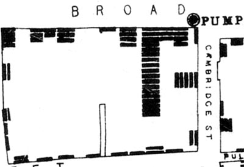
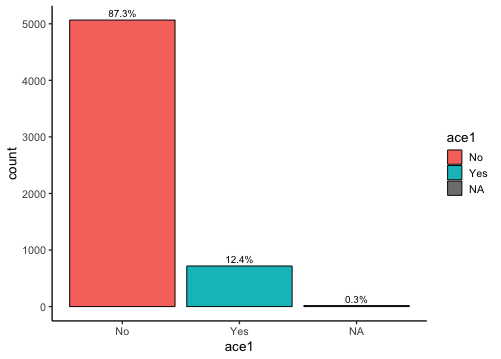
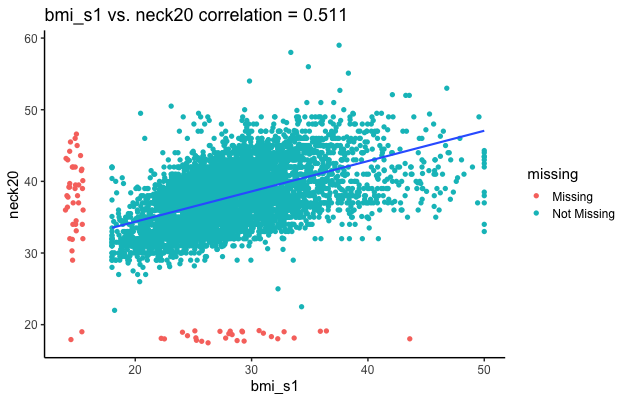

```{r setup, include=FALSE}
options(htmltools.dir.version = FALSE)
```

```{r xaringan-themer, include=FALSE}
library(xaringanthemer)
mono_dark(
  code_font_family = "Fira Code",
  code_font_url    = "https://cdn.rawgit.com/tonsky/FiraCode/1.204/distr/fira_code.css"
)
```

# Learning Objectives for This Session

1. *Understand* the purpose of exploratory data analysis (EDA)
2. *Learn* how to do EDA using `burro`
3. *Answer questions* about associations between variables.

---

# Our Overall Goal  

- Predict 30 day readmission in our patients
- Select appropriate variables in the data to include in our model
- Understand what our variables mean
- Understand interactions between variables
- Output: List of potential variables to add to our model 

---

# What is Exploratory Data Analysis?

- Pioneered by John Tukey
- Detective work on your data
- An *attitude* towards data, not just techniques
- 'Find patterns, reveal structure, and make tenative model assessments (Behrens)'

---

# Remember

"Exploratory data analysis can never be the whole story, but nothing else can serve as the foundation stone."
- John Tukey, *Exploratory Data Analysis*

---

# Why Data Exploration?  

- Need to be aware of issues in the data!


---

# Why Visualization?



---

# Let's look first

- Visualization is a gateway
- Understand the issues, not focus on coding right now
- Build your foundation, then start getting technical

---
# Burro

`burro` is a data explorer package we'll use to examine issues in our dataset. It opens up a dataset and lets us explore different aspects of it:

- Missing data
- Associations
- Correlations

If you're interested in it, you can see more about it here: http://laderast.github.io/burro

We'll be using the website version of burro.

---

# Workflow for selecting variables

Ultimately, in our EDA, we want to make some decisions about which variables we think are useful in predicting cardiovascular disease:

1. **Missingness**: are there too many missing cases in our variable?
2. **Usefulness**: is there an association or correlation with our outcome?
3. **Association:** How associated is our variable with other variables in the model? Should we choose one or the other?
4. **Clinical/domain specific considerations**: How were the data collected? Does that affect our measurement?

---
class: center, middle

# Let's go to https://bit.ly/hip_dw

---
# The Overview Panel

```{r}
knitr::include_graphics("images/sample_image.png")
```

---

# Some Questions for the Overview Panel (5-10 minutes)

As a group, take a look at the following questions and attempt to answer them from the overview panel. 

As you do, take a note of which tab (`Visual Summary`, `Tabular Summary`, and `Data Dictionary`) you found the information in.

Be sure to use your post-it notes if you're confused or need help!
---
# Questions

1. How big is the dataset? (how many rows?)
2. How many categorical variables (also called `factor`s) are there in our dataset?
3. How many missing `readmit30` cases (coded as `NA`) are there?
4. What is the mean age for the dataset? Is it what you expected?

---
# Google Sheet Link

https://bit.ly/hip_sheet
---

# The Category Panel

```{r}

```

---

# Some Questions for the Category Panel (5-10 minutes)

Again, answer these as a group!

6. How many categories are there for `outcome`?
7. Are the proportions of `readmit30` balanced across `admit_source`?
8. If you are older, are you more likely to have had `myocardial_complications`?
9. Is the proportion of missing data for `readmit30` balanced across `outcome` categories? 

---

# The Continuous Panel

```{r}

```

---

# Some Questions for the Continuous Panel (5-10 minutes)

1. Describe the distribution of `age` in our patients. 
2. Is `age` evenly distributed across `readmiy`? If not, how are they distributed?
3. Are `age` and `length_of_stay` correlated? Are you surprised?
4. Should we include both `age` and `myocardial_complications` in our dataset?

---
# Missingness

1. What variables have missing data?
2. Is the missingness correlated for any two variables?
3. How will we deal with this?

---

# Some thoughts on variable selection

Including some variables as predictors when they are interacting can affect the predictive power of their variables.

We'll test these next time.

- Age and Myocardial Infarction

---
# For next time

Select your predictor covariates of `readmit30`

We'll build predictive models of the dataset.

---
# Congratulations

You are now a full fledged data explorer!


---

# Overall

- Data exploration is fun and detective work
- Be curious! Start with a question
- Assess the impact of adding your covariate to the model
    - Does the distribution look like other populations?
    - Is it associated with your outcome?
    - Is it associated with other variables?
    - Is the data missing in a suspicious way?
